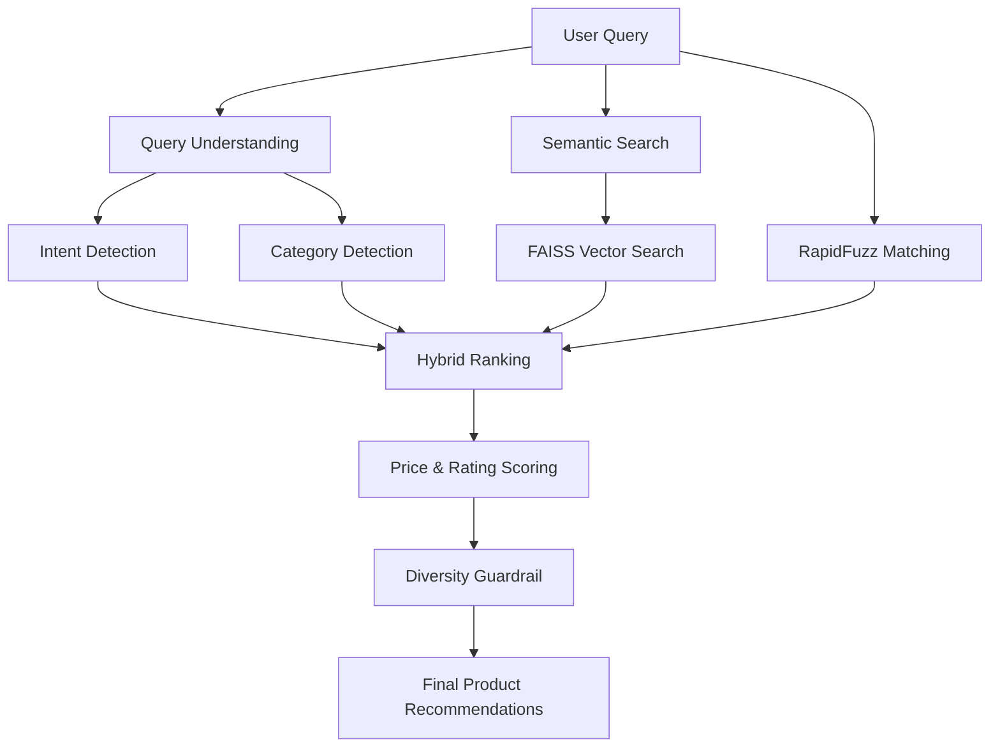
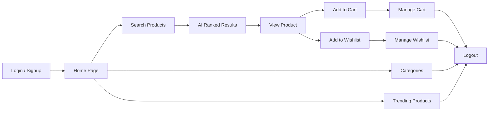

# 🛒 SmartShop AI

## AI-Powered E-Commerce Product Discovery & Recommendation System

**AI Build Placement Hackathon 2026**  
**Track 7 – Discovery Engine**  
**Team T183**

---

## 👨‍💻 Team Details

| Role | Details |
|---|---|
| **Team ID** | T183 |
| **Team Lead** | Attanti Sri Swetha – 2300030052 |
| **Member 1** | Godavarthi Chaturya – 2300090016 |
| **Member 2** | Harshwardhan Raj – 2300090312 |
| **Room** | R705B |

---

## 📌 Project Overview

SmartShop AI is an AI-powered e-commerce product discovery and recommendation system developed for the AI Build Placement Hackathon 2026.

The system helps users discover relevant products using intelligent search and recommendation techniques.

It combines:

- 🤖 Semantic Search
- ⚡ FAISS Vector Search
- 🔤 RapidFuzz Matching
- 🎯 Intent Detection
- 🏷️ Category Detection
- 💰 Price-Aware Ranking
- ⭐ Rating-Based Ranking
- 🛡️ Recommendation Diversity

---

## 🎯 Problem Statement

Traditional product search mainly depends on keywords and may not fully understand what the shopper wants.

For example:

**User Query:**

`cheap running shoes`

The system should understand:

- Intent → **Bargain / Sports**
- Category → **Shoes**
- Preference → **Affordable products**

SmartShop AI uses these signals to provide more relevant product results.

---

## 💡 Solution

SmartShop AI uses a hybrid search and recommendation pipeline:

```text
User Query
    ↓
Query Understanding
    ↓
Intent + Category Detection
    ↓
Semantic Search
    +
FAISS Vector Search
    +
RapidFuzz Matching
    ↓
Hybrid Ranking
    ↓
Price + Rating + Relevance
    ↓
Diversity Check
    ↓
Recommended Products
```
---

## 🧠 AI Architecture



### AI Flow

```text
User Query
    ↓
Intent + Category Detection
    ↓
Semantic Search
    +
FAISS Vector Search
    +
RapidFuzz Matching
    ↓
Hybrid Ranking
    ↓
Price + Rating
    ↓
Diversity Guardrail
    ↓
Final Recommendations
```
---

## 🔄 User Workflow



### Shopping Flow

```text
Login / Signup
      ↓
   Home Page
      ↓
 Search Product
      ↓
 AI Ranked Results
      ↓
  View Product
    ↙      ↘
 Cart     Wishlist
    ↓        ↓
 Manage   Manage
    ↘      ↙
     Logout
```
---

## ✨ Features

- 🔐 Login & Signup
- 🔎 AI Product Search
- 🤖 Product Recommendations
- 🧠 Intent Detection
- 🏷️ Category-Based Search
- ⚡ FAISS Vector Search
- 🔤 RapidFuzz Matching
- 💰 Price-Aware Ranking
- ⭐ Rating-Based Ranking
- 🛡️ Recommendation Diversity
- 👁️ Product Details
- 🛒 Add / Remove Cart
- ❤️ Add / Remove Wishlist
- 📂 Categories
- 🔥 Trending Products
- 🚪 Logout

---

## 🛠️ Technology Stack

### Frontend
- HTML5
- CSS3
- JavaScript
- Jinja2

### Backend
- Python
- Flask

### AI / Search
- Sentence Transformers
- FAISS
- RapidFuzz

### Data Processing
- Pandas
- NumPy

### Dataset
- CSV Product Dataset

---
---

## 🎯 Track 7 – Discovery Engine Alignment

| Requirement | SmartShop AI |
|---|---|
| Intelligent Product Discovery | ✅ |
| Semantic Search | ✅ |
| Vector Search | ✅ FAISS |
| Natural-Language Search | ✅ |
| Intent Detection | ✅ |
| Category-Aware Ranking | ✅ |
| Price-Aware Ranking | ✅ |
| Recommendation Diversity | ✅ |
| Cold-Start Discovery | ✅ Basic |
| Complete-the-Look | ✅ Basic |

---

## 🚀 Future Enhancements

- 👤 Personalized recommendations using user behavior
- 📊 Real-time clickstream-based recommendations
- 🧠 Two-Tower recommendation model
- 🖼️ Multimodal image + text embeddings
- 🤖 LLM-powered shopping assistant
- 📚 RAG-based product search
- 🛍️ Frequently Bought Together recommendations
- ☁️ Cloud deployment
- 🔐 Production-level security and DPDP compliance

---

## 🏆 Conclusion

SmartShop AI combines **semantic search, FAISS vector search, RapidFuzz matching and intelligent ranking** to provide a smarter e-commerce product discovery experience.

The system helps users find relevant products based on their search intent, category, price and rating.

---

## 👥 Team T183

**Attanti Sri Swetha**  
**Godavarthi Chaturya**  
**Harshwardhan Raj**

**AI Build Placement Hackathon 2026**  
**KL University**

---

© 2026 SmartShop AI Team – T183